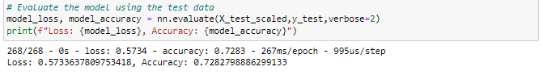
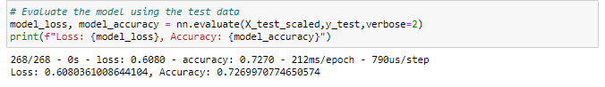

# Analysis
## Overview of the Analysis:

The purpose of this analysis is to create a deep learning model using neural networks to predict the success of charitable organizations funded by Alphabet Soup. 

## Results
### Data Preprocessing
Target Variable:
IS_SUCCESSFUL

Feature Variables:
APPLICATION_TYPE, CLASSIFICATION, AFFILIATION, STATUS, ASK_AMT, and others.

Variables Removed:
EIN and NAME columns were removed as they are non-beneficial identifiers.

### Compiling, Training, and Evaluating the Model

Neural Network Architecture:

-In the original model there are two hidden layers with 80 and 30 neurons respectively.  In the optimized model there are three hidden layers with 80, 30, and 20 neurons respectively.

-Activation functions used are 'relu' for hidden layers and 'sigmoid' for the output layer.  This combination of functions is common for binary classification tasks where the goal in this case is to determine the success or failure of the funding for charitable organizations.

Achieving Target Model Performance:

-The model achieved an accuracy of approximately 73% on the testing dataset.  Which is 2% below the target of 75% target model performance.

Steps to Increase Model Performance:

-Adjusting the number of neurons, layers, and activation functions.

## Summary

The deep learning model showed a reasonable performance with an accuracy of around 73%.  

However, further optimization is possible by adjusting the model architecture, and exploring advanced techniques.   The model's accuracy can be improved by experimenting with different activation functions, adding more hidden layers, and adjusting the number of neurons in each layer.  However even the optimized model also achieved 73%.

## Recommendation

Exploring ensemble models such as Random Forest or Gradient Boosting could work.  These models often achieve well on tabular data and are less sensitive to hyperparameter tuning.